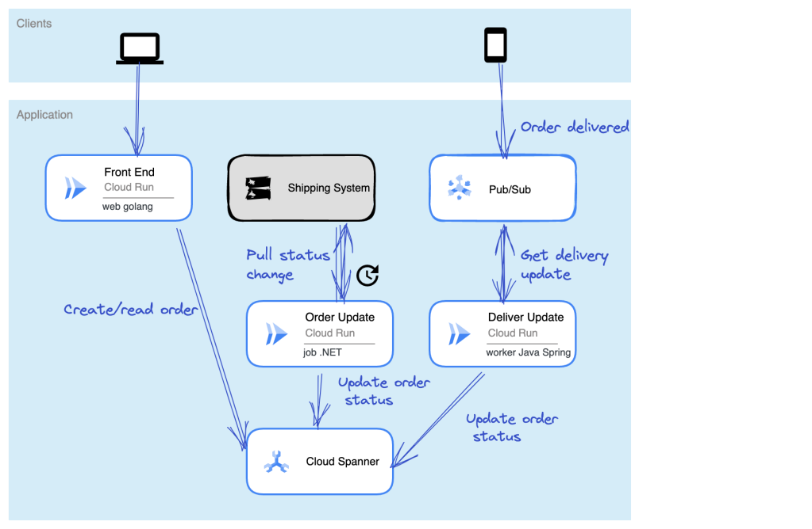

# Order Shop Demo App
Hey there. This repo hosts a three service demo app started by Richard Seroter. I've reworked Richards app a bit and added a bunch of apis, Spanner commit time stamps on all orders, and a OrdersHistory table that shows commit time stamps of all transactions - both committed and failed. Now we can demo how you might think about building an application that is highly available across regions while using a relational database that spans (Spanner - such clever naming :bowtie:) multiple regions with guatanteed ordering. 

If you want to learn more about the applications architecture check out Richard's [blog](https://seroter.com/2022/06/09/running-serverless-web-batch-and-worker-apps-with-google-cloud-run-and-cloud-spanner/).

## Demos
- [Multi-region Cloud Run and Spanner](/demos/multi-region-cr-spanner/multi-region-cr-spanner.md)
- CI with Cloud Code - WIP
- Multi-region GKE and Spanner - WIP