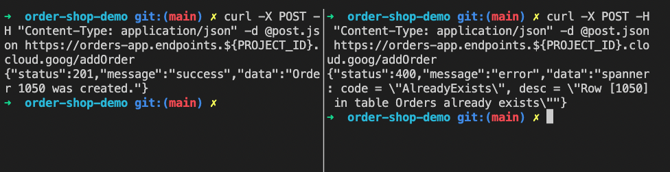
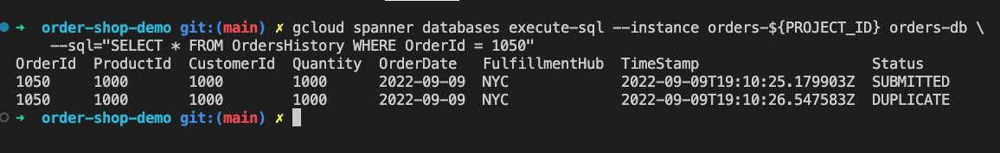

# Multi Region Orders App with Cloud Run and Spanner
This demo builds the Orders Shop app in multiple Cloud Run services across multiple regions and puts them behind a Global Loadbalancer so that you can have one endpoint that distributes users to the closest Cloud Run service.

## Pre-reqs
* [gcloud CLI](https://cloud.google.com/sdk/docs/install)

## Install
Read about [Spanner Configurations](https://cloud.google.com/spanner/docs/instance-configurations) so you can decide which multi-region configuration works best for you. I live in Georgia, so the suggestions I have put below work well for east coast demos.
1. **Download this repo**
```bash
git clone https://github.com/knee-berts/order-shop-demo.git
```
2. **Set envars**

```bash
PROJECT_ID = ##Best to use a clean project you have ownership of.
SPANNER_CONFIG = "nam9" ##Multi-region spanner configuration that works best for your location. 
PRIMARY_REGION = "us-east4" ##Google Cloud Region you want the Spanner R/W Replica leader to live in.
REGIONS=('us-east1' 'us-west1') ##Regions that the web service will be deployed
```

3. **Run install script**
```bash
./bootstrap.sh -p ${PROJECT_ID} -r ${PRIMARY_REGION} -s "${REGIONS}" -d ${SPANNER_CONFIG} "nam9"
```

## Test
1. **After a bit the global orders web link will be available at "https://orders-app.endpoints.$PROJECT_ID.cloud.goog". Create a few orders.**

2. **There is an api that generates an order with random fields. Give it a go.**
```bash
curl -X PUT https://orders-app.endpoints.${PROJECT_ID}.cloud.goog/addRandomOrder
```

3. **There is another api that gets the count of orders by status.**
```bash
curl https://orders-app.endpoints.${PROJECT_ID}.cloud.goog/orderStatusCount/SUBMITTED
```

4. **You can also post an order with specific fields.**
```bash
cat <<EOF > post.json
{
    "OrderId": 1048,
	"ProductId": 1000,
	"CustomerId": 1000,
	"Quantity": 1000,
	"Status": "SUBMITTED",
	"FulfillmentHub": "NYC"
}
EOF
curl -X POST -H "Content-Type: application/json" -d @post.json https://orders-app.endpoints.${PROJECT_ID}.cloud.goog/addOrder
```

5. **Let's see what happens when we post the same order simultaneously from two terminals on our computer. I use tmux for this and the instructions below are all assuming tmux has defaults.**
```bash
## Change the OrderID in the post.yaml
cat <<EOF > post.json
{
    "OrderId": 1050,
	"ProductId": 1000,
	"CustomerId": 1000,
	"Quantity": 1000,
	"Status": "SUBMITTED",
	"FulfillmentHub": "NYC"
}
EOF
## start tmux
tmux

## Split Terminal 
## ctrl + b then shift + %

## Synchronize the panes
## ctrl + b then :setw synchronize-panes

## Now you can call the api from both panes with the same post.yaml file you previosly created
curl -X POST -H "Content-Type: application/json" -d @post.json https://orders-app.endpoints.${PROJECT_ID}.cloud.goog/addOrder
```
Your output should look something like this. Notice that one order create wins while the other throws an error that the orderid already exists.


6. **Now let's query the OrdersHistory table in Spanner so we can see the time stamp difference between the two attempted order creations.**
```bash
gcloud spanner databases execute-sql --instance orders-${PROJECT_ID} orders-db \
    --sql="SELECT * FROM OrdersHistory WHERE OrderId = 1050" 
```
You should see something like this.


7. **Throw some load at it by using [hey](https://github.com/rakyll/hey) to call the random orders generator api**
```bash
hey -m PUT https://orders-app.endpoints.${PROJECT_ID}.cloud.goog/addRandomOrder
```